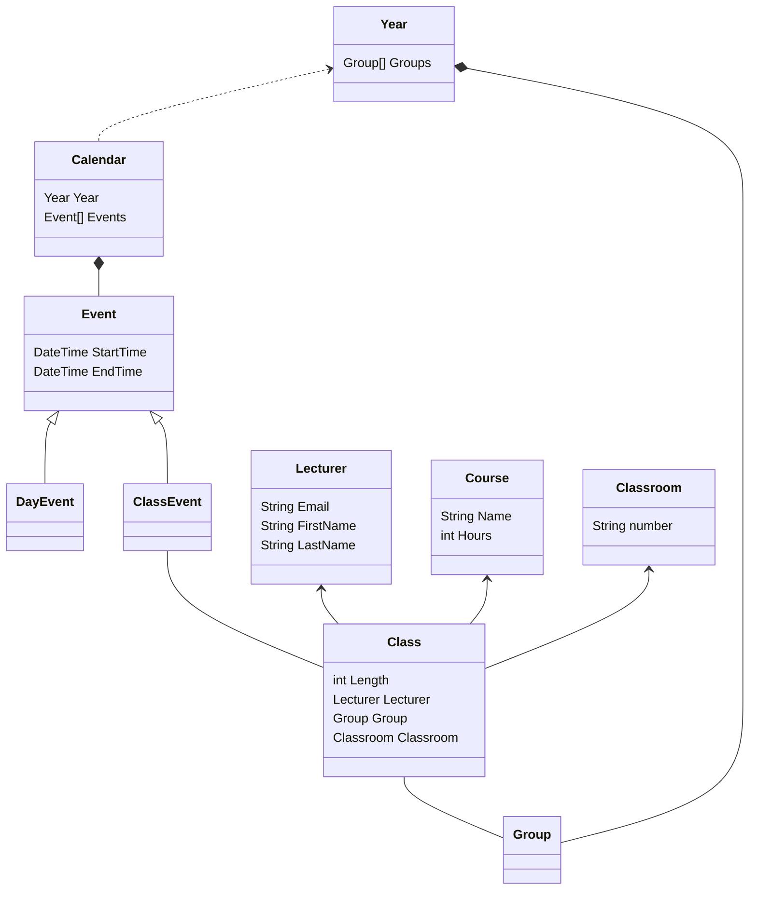

```mermaid
classDiagram
    
    class Year {
        Group[] Groups
    }
    Year <.. Calendar
    
    class Group
    Group --* Year
    
    class DayEvent
    class ClassEvent
    ClassEvent -- Class
    
    class Event {
        DateTime StartTime
        DateTime EndTime
    }
    Event <|-- DayEvent
    Event <|-- ClassEvent
   
    class Calendar {
        Year Year
        Event[] Events
    }
    Calendar *-- Event

    class Lecturer {
        String Email
        String FirstName
        String LastName
    }
    Lecturer <-- Class
    
    class Course {
        String Name
        int Hours
    }
    Course <-- Class
    
    class Classroom {
        String number
    }
    Classroom <-- Class
    
    class Class {
        int Length
        Lecturer Lecturer
        Group Group
        Classroom Classroom
    }
    Class -- Group
```